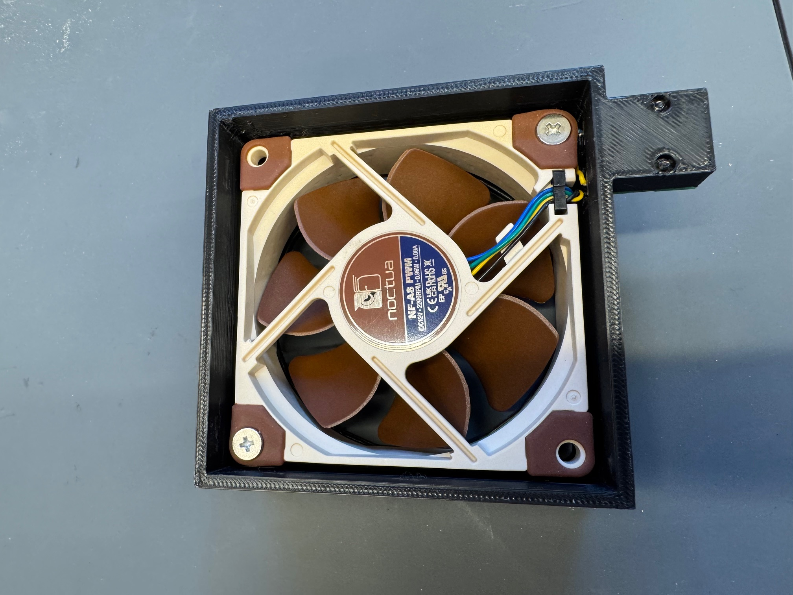
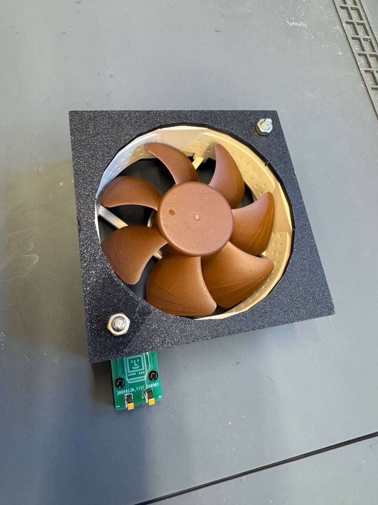

# Macintosh Color Classic Fan Housing

## What

This printable is a drop-in replacement for the Macintosh Color Classic Fan Housing.
Also known as part 805-0222.

## Used parts
- [x] Noctua NF-A8 PWN FAN
- [x] 2x S7051-42R springcontact ([Mouser link](https://nl.mouser.com/ProductDetail/Harwin/S7051-42R?qs=Qom7kyPojXa30NoD3AVhZQ%3D%3D&utm_id=9873309020&gad_source=1&gclid=Cj0KCQjwu-63BhC9ARIsAMMTLXTTr4Ftdfo36wKnyACNP_Q4Dj9xMSRrUUrDrJGB1fXVW7vOQsOo9cAaAhdpEALw_wcB))
- [x] 1x PCB
- [x] 2x (10mm M2 screw + nut)

## How to
- Order the PCB at your favorite PCB supplier with 1.6MM thickness. HASL finish is just fine.
- 3D print the housing. (*Support on build plate only!)
- Solder on the S7051-42R springs to the PCB
- Secure the PCB to the 3D printed bracket with 2 M2 screws
- Solder on the Yellow (+) and the black (-) cable of the fan to the other side of the board.

## Disclaimer
I will not be held liable for damages, injury or even death resulting from this part. Build and use this part only at your own risk.

